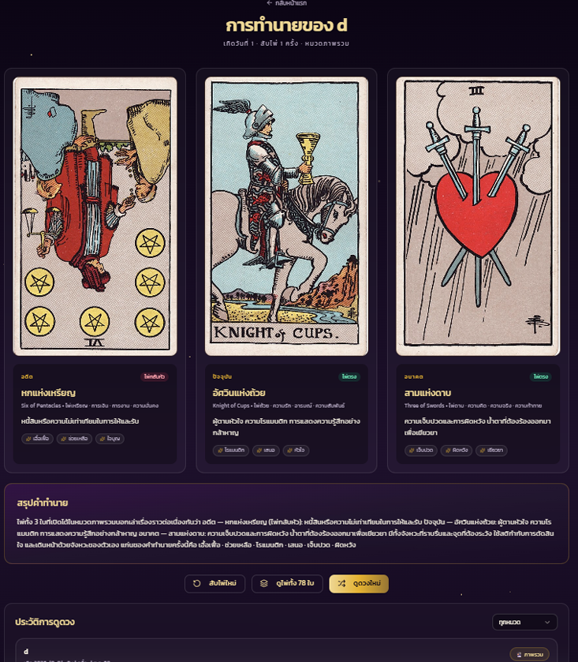
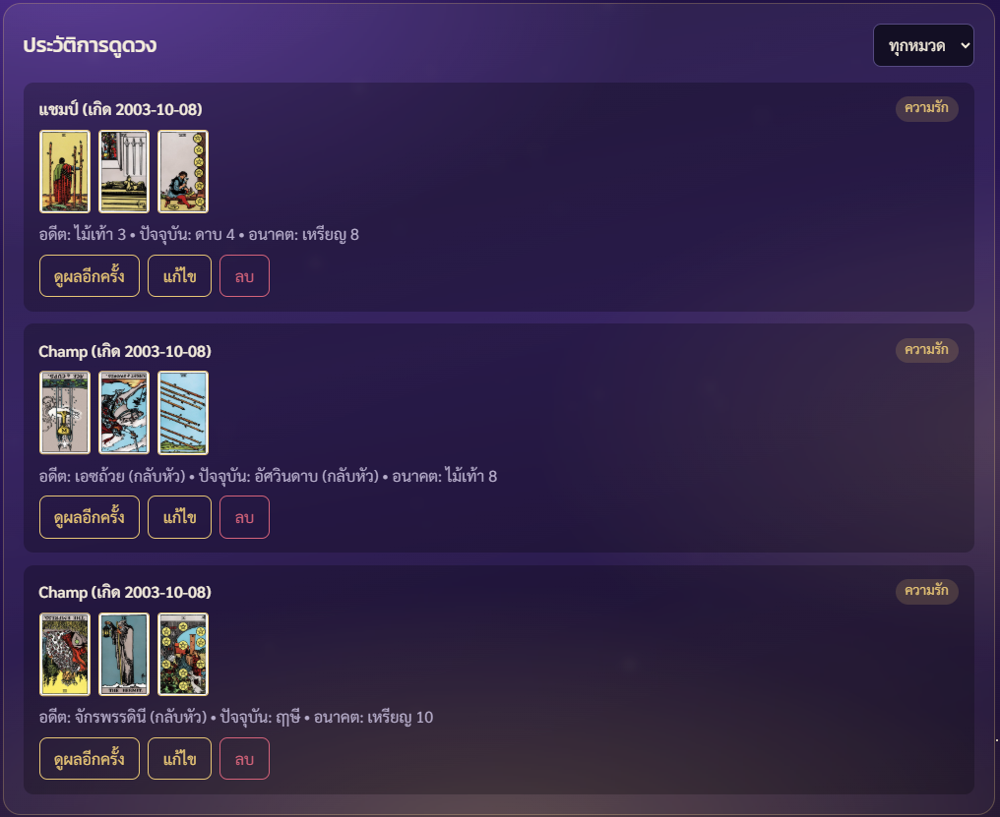
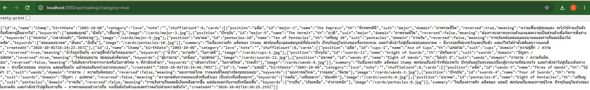

# 🔮 ไพ่ยิปซีประจำวันเกิด (Tarot Reading — Full-stack REST API)

เว็บดูดวงไพ่ยิปซีที่ผู้ใช้กรอก **ชื่อ** และ **วันเกิด** แล้วระบบจะ **สับไพ่เท่ากับวันที่เกิด**
เช่น เกิดวันที่ 4 = สับไพ่ 4 ครั้ง (แอนิเมชันสับตามจำนวนนี้ แต่ไม่บอกตัวเลขกับผู้ใช้) จากนั้น **ผู้ใช้เลือกไพ่ 3 ใบเอง**
จากแกลเลอรีวงกลม (อดีต / ปัจจุบัน / อนาคต) จากสำรับ **ทั้ง 78 ใบ (Major 22 + Minor 56)** มีโอกาสออกไพ่กลับหัว พร้อมรูปไพ่ คำอธิบาย คำสำคัญ และสรุปคำทำนาย และเก็บประวัติไว้ให้ดู แก้ไข และลบได้

Mini Project: Node.js + Express (backend) และ HTML / CSS / JavaScript (frontend)

## โครงสร้างโปรเจกต์
```
tarot-api/
├── server/
│   ├── server.js      # Express + REST API
│   ├── cards.js       # ข้อมูลไพ่ทั้ง 78 ใบ (ความหมายตรง/กลับหัว)
│   └── data.json      # สร้างอัตโนมัติเมื่อมีข้อมูล
├── public/
│   ├── index.html
│   ├── style.css
│   ├── app.js         # fetch() เรียก API ของตัวเอง + ขั้นตอนสับ/เลือกไพ่
│   ├── circular-gallery.js  # แกลเลอรีวงกลม (ogl / WebGL) ให้คลิกเลือกไพ่
│   └── cards/         # รูปไพ่ 78 ใบ (major-0.jpg, cups-1.jpg ...)
├── docs/              # ภาพ screenshot
├── package.json
└── README.md
```

## วิธีติดตั้งและรัน
```bash
npm install
npm run dev     # หรือ npm start
```
เปิดเบราว์เซอร์ที่ http://localhost:3000

## Resource: `readings`
| field | ชนิด | คำอธิบาย |
|---|---|---|
| id | number | รหัส (สร้างอัตโนมัติ) |
| name | string | ชื่อผู้ดูดวง (จำเป็น, ≤ 50 ตัวอักษร) |
| birthDate | string | วันเกิด `YYYY-MM-DD` (จำเป็น, ต้องเป็นวันที่จริง) |
| category | string | `general` / `love` / `career` / `money` (ค่าเริ่มต้น `general`) |
| note | string | บันทึกส่วนตัว (≤ 300 ตัวอักษร) |
| shuffleCount | number | จำนวนครั้งที่สับไพ่ = วันที่เกิด (เก็บใน API แต่หน้าเว็บไม่แสดง) |
| cards | array | ไพ่ที่จั่วได้ 3 ใบ (ตำแหน่ง, ชื่อ, รูป, กลับหัวหรือไม่, ความหมาย, คำสำคัญ) |
| summary | string | สรุปคำทำนายจากไพ่ทั้ง 3 ใบ |
| createdAt | string | เวลาที่สร้าง (ISO) |

## Endpoints
| Method | Path | คำอธิบาย | Status |
|---|---|---|---|
| GET | `/api/readings` | ดึงทั้งหมด กรองได้ด้วย `?category=love` และ `?name=มะลิ` | 200 |
| GET | `/api/readings/:id` | ดึงรายการเดียว | 200 / 404 |
| POST | `/api/readings` | สร้างการดูดวงใหม่ (ระบบสับไพ่ตามวันเกิด แล้วหยิบไพ่ตาม `picks` ที่ผู้ใช้เลือก) | 201 / 400 |
| PATCH | `/api/readings/:id` | แก้ `name`, `category`, `note` | 200 / 400 / 404 |
| DELETE | `/api/readings/:id` | ลบ | 204 / 404 |

ฟิลด์เพิ่มเติมของ POST: `picks` (ไม่บังคับ) = ตำแหน่งไพ่ 3 ใบที่ไม่ซ้ำกัน ช่วง 0-77 ในลำดับ อดีต/ปัจจุบัน/อนาคต
ถ้าไม่ส่งมา ระบบจะใช้ 3 ใบบนสุดของสำรับที่สับแล้ว

### ตัวอย่าง
```bash
curl -X POST http://localhost:3000/api/readings \
  -H "Content-Type: application/json" \
  -d '{"name":"มะลิ","birthDate":"2000-05-04","category":"love","picks":[10,40,77]}'
# -> 201, shuffleCount = 4

curl "http://localhost:3000/api/readings?category=love"
curl -X PATCH http://localhost:3000/api/readings/1 -H "Content-Type: application/json" -d '{"note":"ขอให้เป็นจริง"}'
curl -X DELETE http://localhost:3000/api/readings/1
```

## ฟีเจอร์ฝั่งไคลเอนต์
- แสดงประวัติด้วย `fetch()` จาก GET โดยไม่โหลดหน้าใหม่ และกรองตามหมวดได้
- กดสับไพ่ -> แอนิเมชันสับตามวันเกิด (ไม่แสดงจำนวนรอบ) -> เลื่อน/ลากแกลเลอรีแล้วคลิกเลือกไพ่ 3 ใบเอง -> เรียก POST แล้วเปิดไพ่ทีละใบ (กดช่อง อดีต/ปัจจุบัน/อนาคต เพื่อยกเลิกใบที่เลือก หรือกด "เลือกใหม่")
- แกลเลอรีวงกลมใช้ [ogl](https://github.com/oframe/ogl) (ติดตั้งผ่าน `npm install` และเปิดให้เบราว์เซอร์ผ่าน `/vendor/ogl`)
- ปุ่มแก้ไข (PATCH) และลบ (DELETE)
- เรียกเฉพาะ API ของตัวเอง ไม่ดึงข้อมูลจาก API ภายนอก

## Screenshots






## เครดิต
- ภาพไพ่: Rider–Waite–Smith (Pamela Colman Smith, 1909) เป็นงาน public domain รวบรวมโดย [mixvlad/TarotCards](https://github.com/mixvlad/TarotCards)
- แนวทางตีความความหมายไพ่: อ้างอิงบทความของ The Street Ratchada และเรียบเรียงข้อความใหม่
- เนื้อหาเพื่อความบันเทิงเท่านั้น
